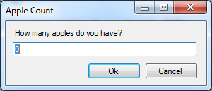

# winforms-prompt
A winforms user input dialog inspired by Javascript window.Prompt().

#usage

```c#
Prompt.ShowDialog();
```


```c#
Prompt.ShowDialog("Apple Count", "How many apples do you have?");
```


```c#
Prompt.ShowDialog("Apple Count", "How many apples do you have?", "0");
```


